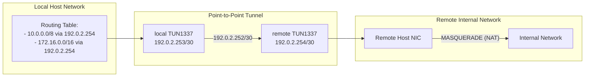

# SSH point-to-point tunnel

## Objective

When doing a internal network assessment, it may be required to tunnel traffic trough a device deployed on premise. This device can be a virtual machine, a raspberry pi, etc.

A common way to go about this is to have the device connect back to a server under your control and expose its SSH port. Then use `DynamicForward` to create a SOCKS proxy. 

The downside to this is that each tool/command needs to be configured to use the proxy. Also, workarounds to tunnel UDP traffic such as DNS need to be configured.

Using a point-to-point (PtP) tunnel fixes all the SOCKS proxy issues. Traffic is sent trough the tunnel via routes (L3) so it handles TCP and UDP natively.


## Configuration

### Local

#### ssh_config

The following is an host block example with all the options required.

```shell
Host ptp
	Hostname $hostname
	User $user
	Port $port
	IdentityFile $ssh_key
	SessionType none
	Tunnel point-to-point
	TunnelDevice 1337:1337
	ExitOnForwardFailure yes
```

#### systemd-networkd NetDev

By creating the TUN device ahead of time, we can assign it the right permissions to avoid using **root** privileges. The permissions are managed under the **[Tun]** section. Configure the relevant values for the user that will establish the SSH connection.

```systemd
# /etc/systemd/network/ssh_ptp.netdev
[NetDev]
Name=tun1337
Kind=tun

[Tun]
Group=$group
User=$user
```

#### systemd-networkd Network

Time to configure the network interface. The configuration will contain at the minimum the required information to reach the peer on the other side of the tunnel. At most, the configuration may contain reachable network routes, and remote DNS resolution.

```systemd
# /etc/systemd/network/ssh_ptp.network
[Match]
Name=tun1337

[Address]
Address=192.0.2.253/30
Peer=192.0.2.254/32

[Network]
# Disable IPv6
LinkLocalAddressing=ipv4
# Remote authoritative DNS for local domain
#DNS=x.x.x.x
#Remote DNS zone(s) - space separated
#Domains=~example.com

# This block adds reachable networks to the local routing table
# The routes are added when the interface is operational, and are removed when it is not.
# Multiple [Route] sections can be added to reach more networks
#[Route]
#Gateway=192.0.2.254
#Destination=x.x.x.x/x
```



The final step is to reload systemd-networkd.

```shell
$ sudo networkctl reload
```


### Remote

#### sshd_config

Edit the SSH server configuration to enable Tunneling and reload the service

```sshd_config
# /etc/ssh/sshd_config
PermitTunnel yes
```
```shell
$ sudo systemctl reload ssh
```

#### systemd-networkd NetDev

By creating the TUN device ahead of time, we can assign it the right permissions to avoid using **root** privileges. The permissions are managed under the **[Tun]** section. Configure the relevant values for the user that will establish the SSH connection.

This will be the user account used to connect to the SSH server.

```systemd
# /etc/systemd/network/ssh_ptp.netdev
[NetDev]
Name=tun1337
Kind=tun

[Tun]
Group=$group
User=$user
```

#### systemd-networkd Network

Time to configure the network interface. The configuration will contain at the minimum the required information to reach the peer on the other side of the tunnel. 

```systemd
# /etc/systemd/network/ssh_ptp.network
[Match]
Name=tun1337

[Address]
Address=192.0.2.254/30
Peer=192.0.2.253/32

[Network]
# Disable IPv6
LinkLocalAddressing=ipv4
```

The final step is to reload systemd-networkd.

```shell
$ sudo networkctl reload
```

#### Configure NAT/Masquerade

Time to configure NAT so the incoming traffic from the tunnel will exit using the remote LAN interface IP.

```shell
$ sudo iptables --policy FORWARD ACCEPT
$ sudo iptables -t nat -A POSTROUTING -s 192.0.2.253 ! -d 192.0.2.254 -o REMOTE_OUTGOING_INTERFACE -j MASQUERADE
```


### Diagnostic

Once both ends are configured and the required services are reloaded (SSH and systemd-networkd), it is time to validate that all is in working order. Of course, you may simply connect to the SSH host and go about it.

#### Check that the TUN devices are created (local and remote)

```shell
ip -brief link show type tun
```

#### Check that each the tunnel peers can reach each other

##### Local

```shell
$ ping 192.0.2.254
```

##### Remote

```shell
$ ping 192.0.2.253
```

#### Check that the outgoing traffic is using the remote LAN IP

The idea is to generate traffic and listen for it using `tcpdump`. The following example uses ICMP, but any protocol will do.

##### Remote

```shell
$ sudo tcpdump -i tun1337 -f 'icmp'
```

##### Local

```shell
$ ping REMOTE_HOST
```

#### Check that the route blocks in systemd-networkd were added

```shell
$ ip route list
```

Should the routes not be there, check the logs with `journalctl -eu systemd-networkd`.


