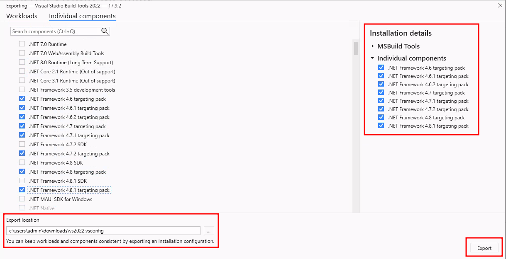
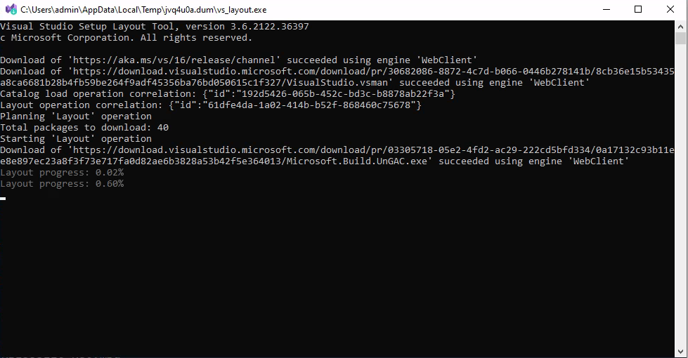

# Download offline .Net Framework target pack

## Objective

Building tools may require an older target framework. These framework may not be accessible indefinitely.

The following steps will show how to build an offline installation die multiple Visual Studio versions where each of them will have all their native target framework available.

I'll refer often to Build Tools for Visual Studio, but as far that I have seen, it is the same binary that downloads everything related to that Visual Studio version.

## Configuration

Get a copy if the Build Tools for Visual Studio installer. The following links are provided as a courtesy and are not expected to be valid for very long:

- [Current VS download](https://visualstudio.microsoft.com/downloads/)
- [Older VS download](https://visualstudio.microsoft.com/vs/older-downloads/)
- [All VS download](https://my.visualstudio.com/) but require to log in

Once you have these initial package, feel free to rename them with their year. such as:

- `vs_buildtools_2017.exe`
- `vs_buildtools_2019.exe`
- `vs_buildtools_2022.exe`

Now, to generate the **vsconfig** file that will contain the name of the packages we wish to have offline. Launch each installer with the following argumens `export --config %USERPROFILE%\downloads\vs%YEAR%.vsconfig`

```powershell
PS > vs_buildtools_2017.exe export --config %USERPROFILE%\downloads\vs2017.vsconfig
PS > vs_buildtools_2019.exe export --config %USERPROFILE%\downloads\vs2019.vsconfig
PS > vs_buildtools_2022.exe export --config %USERPROFILE%\downloads\vs2022.vsconfig
```

Follow the first few prompts until you get to this screen. Then add a check mark on all the target packs you need.



Once exported, the content should look something like:

```json
{
  "version": "1.0",
  "components": [
    "Microsoft.VisualStudio.Component.Roslyn.Compiler",
    "Microsoft.Component.MSBuild",
    "Microsoft.VisualStudio.Component.CoreBuildTools",
    "Microsoft.VisualStudio.Workload.MSBuildTools",
    "Microsoft.Net.Component.4.6.1.TargetingPack",
    "Microsoft.Net.Component.4.TargetingPack",
    "Microsoft.Net.Component.4.5.TargetingPack",
    "Microsoft.Net.Component.4.5.1.TargetingPack",
    "Microsoft.Net.Component.4.5.2.TargetingPack",
    "Microsoft.Net.Component.4.6.TargetingPack",
    "Microsoft.Net.Component.4.6.2.TargetingPack",
    "Microsoft.Net.Component.4.7.TargetingPack",
    "Microsoft.Net.Component.4.7.1.TargetingPack",
    "Microsoft.Net.Component.4.7.2.TargetingPack"
  ],
  "extensions": []
}
```

The installer ended up being very fussy and wanted canonical paths. I redid the directory structure to make typing the commands faster

```powershell
PS > tree /f c:\vs
C:\VS
├───configs
│       2017.vsconfig
│       2019.vsconfig
│       2022.vsconfig
│
└───layouts
    ├───2017
    ├───2019
    └───2022
```

To generate the offline layouts, use the following commands:

```powershell
PS > .\vs_buildtools_2017.exe --layout C:\vs\layouts\2017 --config C:\vs\configs\2017.vsconfig --lang en-US
PS > .\vs_buildtools_2019.exe --layout C:\vs\layouts\2019 --config C:\vs\configs\2019.vsconfig --lang en-US
PS > .\vs_buildtools_2022.exe --layout C:\vs\layouts\2022 --config C:\vs\configs\2022.vsconfig --lang en-US
```

It will look like this.



Finally, to install the packages on a host, copy the content of `C:\vs\layouts\$YEAR` to it and use the following command:

```powershell
PS > .\vs_buildtools_2017.exe install --noweb
PS > .\vs_buildtools_2019.exe install --noweb
PS > .\vs_buildtools_2022.exe install --noweb
```

