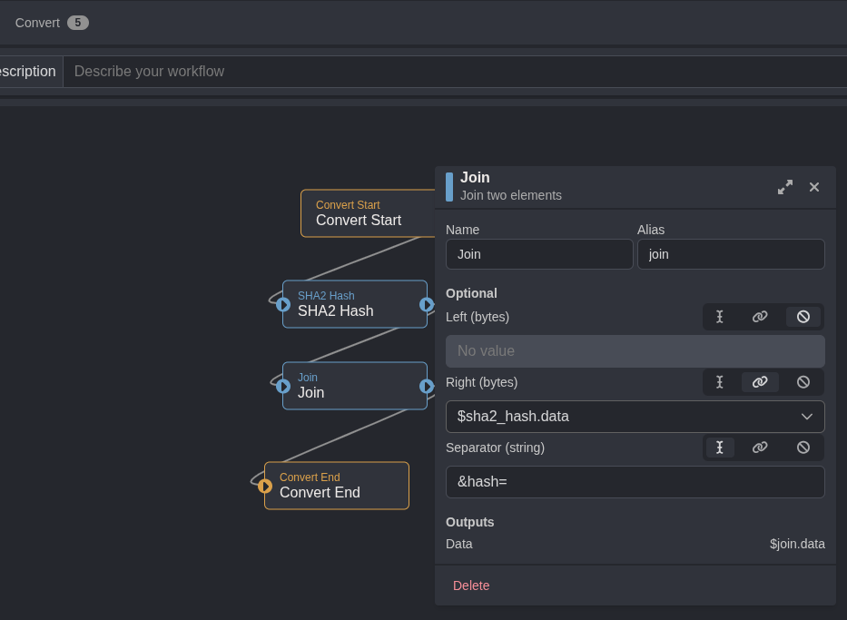

## Objective
Getting to know Caido through their labs at https://labs.cai.do

## Labs

### Match and Replace

Not much to say, the functionality is pretty easy to use and test.

### IDOR Vulnerability
I used Automate to iterate over the user IDs from 0 to 100.

Filtering the non-existant users was easy with an HTTPQL query:
```sql
resp.raw.ncont:"User not found"
```


And the super admin API key!


### Autorize IDOR Testing
The authentication and authorization is done with an Authorization HTTP header.
I used Authorized to create two new users.


And two mutations for each users.


**/autorize.php?action=messages** had sensitive messages and were accessible to all authenticated users.


### Too Many Requests
The lab asks to find the secret value in a 100 requests.
Using HTTPQL:
```sql
resp.raw.ncont:"Try again"
```

### ShaSigned

Following up in the previous IDOR lab, the request how has a **hash** data field passed in the POST request.

The **hash** value is the SHA256 or the **user_id={id}**.

To automate this, I used a Convert workflow.




The workflow could have been applied automatically to Automate but it is not available on the free tier.


### CSRF via Content-Type


I'll have to read up on this one.
