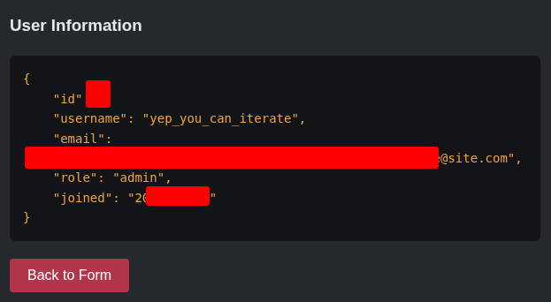
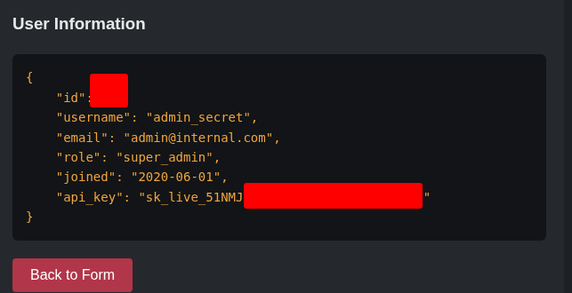
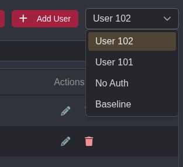
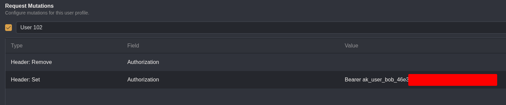
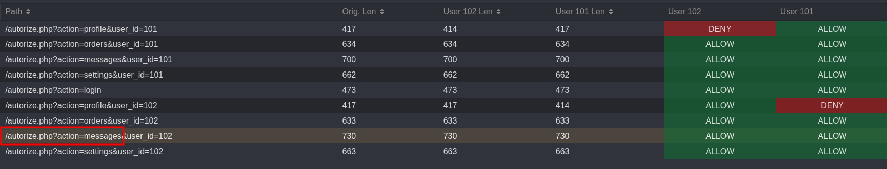

## Objective
Getting to know Caido through their labs at https://labs.cai.do

## Labs

### Match and Replace

Not much to say, the functionality is pretty easy to use and test.

### IDOR Vulnerability
I used Automate to iterate over the user IDs from 0 to 100.

Filtering the non-existant users was easy with an HTTPQL query:
```sql
resp.raw.ncont:"User not found"
```




And the super admin API key!




### Autorize IDOR Testing
The authentication and authorization is done with an Authorization HTTP header.
I used Authorized to create two new users.




And two mutations for each users.



**/autorize.php?action=messages** had sensitive messages and were accessible to all authenticated users.


